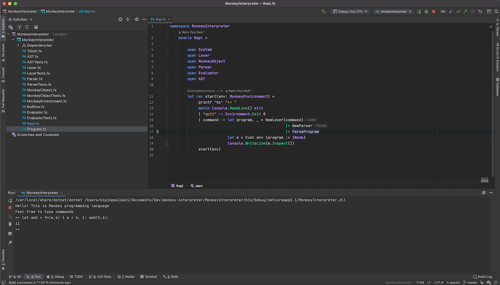

## What & Why

After reading <a href="https://amzn.to/3lGUeBe">"Writing an interpreter in go"</a> by <a href="https://thorstenball.com/">“Thorsten Ball”</a>, I was convinced that a developer’s journey is not complete if they never wrote a compiler/interpreter or at least a parser from scratch. Though it is wisely said never to reinvent the wheel, and parser is a solved problem; various parser generators can be utilised for any DSL, also know as compilers-compiler. But when you are learning never take any shortcuts, so to create the interpreter, I attempted to write even the parser from scratch.

After reading the book, I attempted to create my interpreter for <a href="https://monkeylang.org/">Monkey Programming Language</a> in <a href="https://fsharp.org/">F#</a>. The result is far from perfect, but I was able to learn a lot about F#. Currently, there are 124 unit tests in the project out of which 88 are passing; and if you plan to study and fix the code further I would advise that majority of things can be improved by making a minor adjustment in the parser.fs.

The motivation to execute this project was to understand how the computer evaluates the instructions so that I can be better at designing and implementing software.

Source Code - <a href="https://github.com/bipinpaulbedi/monkey-interpreter" target="_blank">Github</a>  

## How

The mind map above provides the key components that can be described as:

1) Token - This is the vocabulary that our interpreter can understand. We define various reserved keywords and other grammatical rules.

2) Lexor - This is the component that is responsible for reading our source code and convert it to the various token as per our language rules. This component differentiates as assign meaning to plain English and marks items as valid or invalid.

3) AST - Abstract Syntax Tree is a tree structure that our parser will create after reading input from Lexor. Only a well informed AST could be evaluated by our evaluator.

4) Parser - This is the component that converts our Tokens from Lexor into AST. If the parser succeeds, then it ensures that the code is valid and will evaluate to conformant interpreter output.

5) Evaluator - This component consumes the AST generated by the parser and produces an evaluated object structure.

6) Object Structure - This is the evaluated output of AST.

7) Environment - This is the components that provide support for managing state machine during evaluation including access to inbuild functions and closures.

## Lessons

1) Parser is the foundation and any bug at that level is going to bubble up further down the chain.

2) If F# file order or declaration before use is your concern, then do check out delegates and circular types.

3) If you use functional programming since there is very minimal boilerplate code, then your total line of code reduces to approximately 50%. However, this is subjective, but it happened in this particular scenario.

4) Monads are your best friend when it comes to elevated functional programming.

5) Done is better than perfect.

